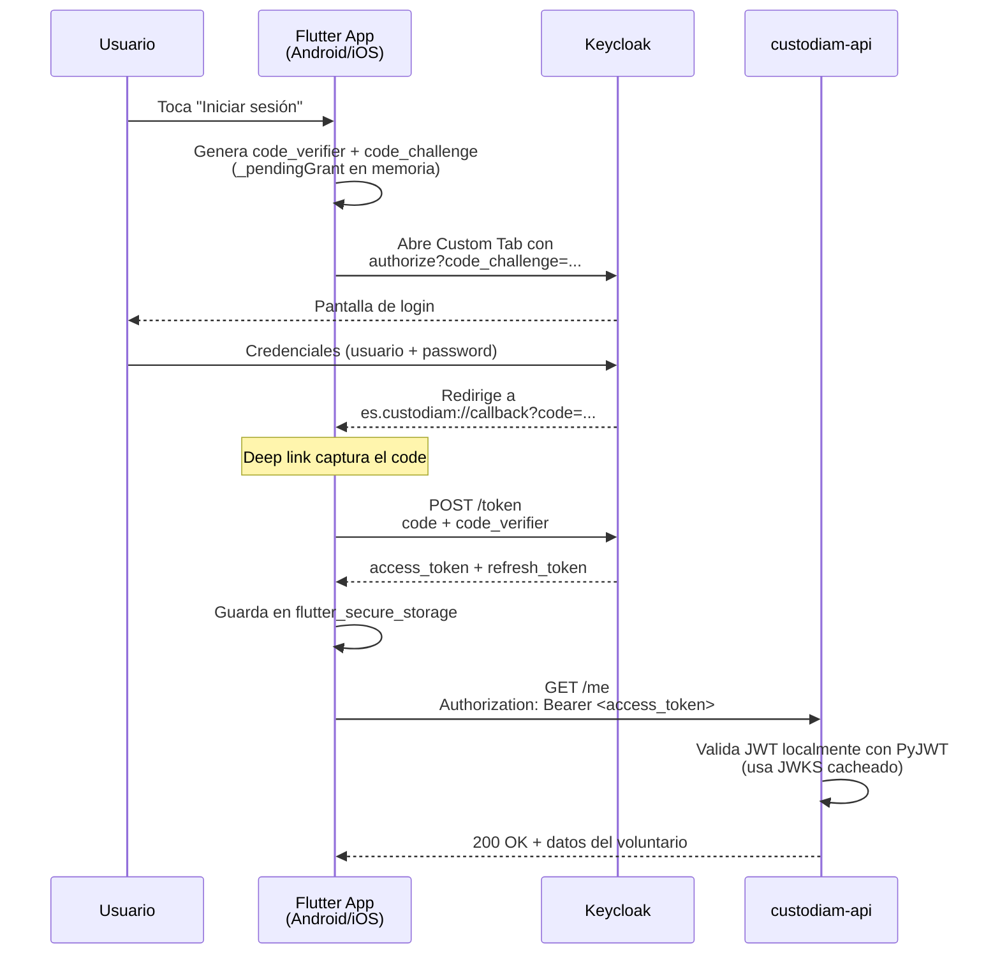
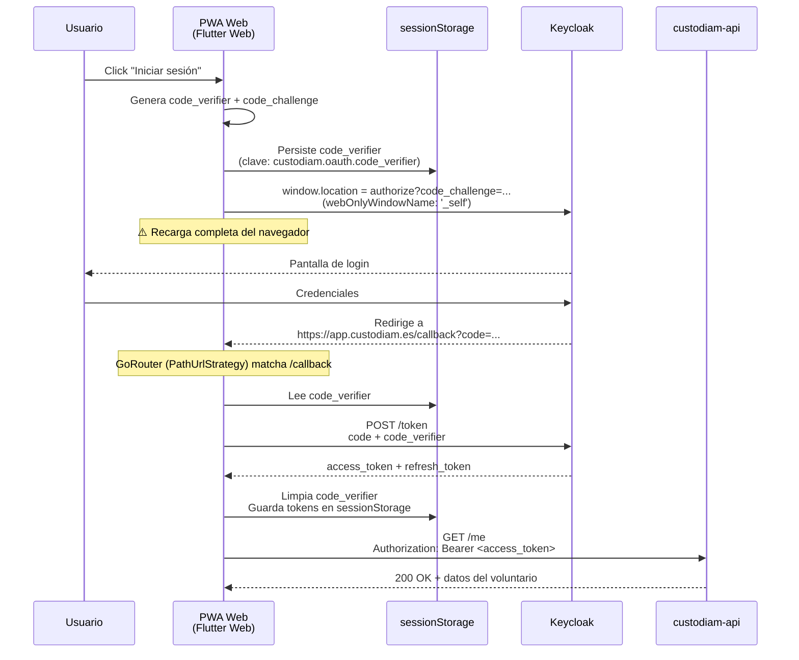
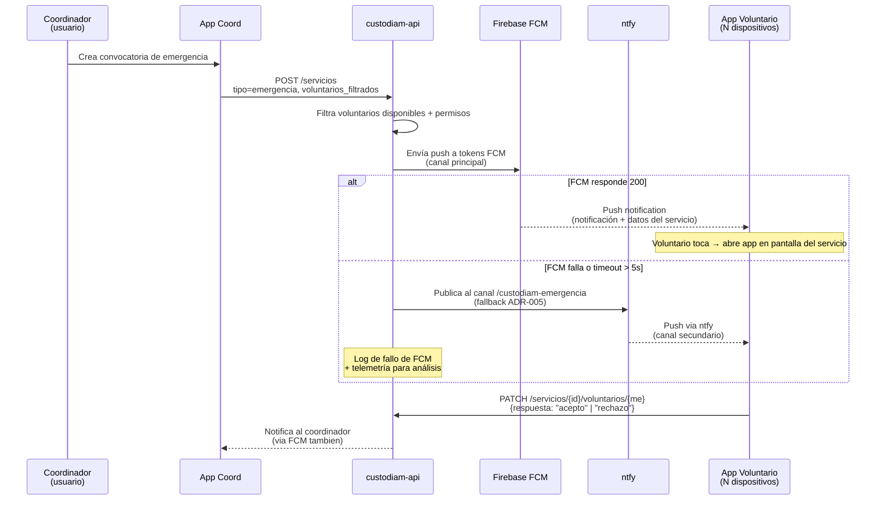

# Diagramas del sistema

Diagramas Mermaid de los flujos principales del sistema. Renderizados nativamente por el plugin `mkdocs-mermaid2-plugin`.

## Topología de despliegue (modo producción)

```d2
direction: down

internet: Internet {
  shape: cloud
}

cf: Cloudflare Edge {
  style.fill: "#fef7ed"
  style.stroke: "#f97316"

  dns: DNS\ncustodiam.es {
    shape: circle
  }
  tunnel: Tunnel\ncloudflared
  book_pages: GitHub Pages\ndocs.custodiam.es {
    shape: page
  }
}

host: PC anfitrión (modo prod) {
  style.fill: "#f8fafc"
  style.stroke: "#475569"

  compose: Docker Compose --profile tunnel {
    style.italic: true
  }

  stack: Stack de servicios {
    style.fill: "#ffffff"

    web: custodiam-web\n(Nginx + PWA Flutter)\n:80
    api: custodiam-api\n:8000
    keycloak: Keycloak 26\n:8080
    db: PostgreSQL 15 {
      shape: cylinder
    }
    ntfy: ntfy\n:80
  }
}

internet -> cf.dns: HTTPS
cf.dns -> cf.tunnel: app/api/auth/ntfy.custodiam.es
cf.dns -> cf.book_pages: docs.custodiam.es

cf.tunnel -> host.stack.web: cloudflared connect {style.stroke-dash: 3}
cf.tunnel -> host.stack.api: cloudflared connect {style.stroke-dash: 3}
cf.tunnel -> host.stack.keycloak: cloudflared connect {style.stroke-dash: 3}
cf.tunnel -> host.stack.ntfy: cloudflared connect {style.stroke-dash: 3}

host.stack.api -> host.stack.db
host.stack.keycloak -> host.stack.db
host.stack.api -> host.stack.keycloak: admin API {style.stroke-dash: 3}
```

## Flujo OAuth2 + PKCE (móvil)



## Flujo OAuth2 + PKCE (web)



!!! info "Asimetría móvil/web — ADR-023"
    La diferencia clave entre móvil y web: en móvil la app sobrevive la redirección al IdP (deep link vuelve a la misma instancia con el `_pendingGrant` intacto en memoria); en web, la navegación a Keycloak recarga la PWA completa, perdiendo el estado en memoria. Por eso web necesita persistir el `code_verifier` en `sessionStorage` antes de redirigir. Se implementa con dos `AuthService` distintos seleccionados vía `kIsWeb`. Detalle completo en [ADR-023 del repo privado].

## Flujo de notificación de emergencia



## Despliegue del book de documentación

```d2
direction: down

dev: Dev\n(commit + push)
gh: GitHub Actions\nworkflow deploy.yml {
  shape: hexagon
}
pages: GitHub Pages\nbranch gh-pages {
  shape: page
}
dns: Cloudflare DNS\nCNAME docs → custodiam.github.io\n(DNS only, sin proxy) {
  shape: cloud
}
user: Usuario {
  shape: person
}

dev -> gh: push a main
gh -> gh: uv sync + mkdocs build
gh -> pages: peaceiris/actions-gh-pages@v4
user -> dns: https\://docs.custodiam.es
dns -> pages: resuelve a IP de GitHub Pages
user -> pages: fallback custodiam.github.io/custodiam-book/ {
  style.stroke-dash: 3
}
```

!!! tip "Resiliencia vendor-lock-free"
    El sitio sigue siendo accesible en `https://custodiam.github.io/custodiam-book/` aunque Cloudflare desaparezca: solo se perdería el dominio "bonito" `docs.custodiam.es`. Cloudflare se reserva como CDN opcional futuro (toggle `Proxied` reversible). Decisión en [ADR-027].

## Referencias

- **[Stack técnico](stack.md)** — tecnologías concretas con versiones.
- **[ADRs](../adrs/index.md)** — decisiones arquitectónicas que sostienen estos diagramas.
