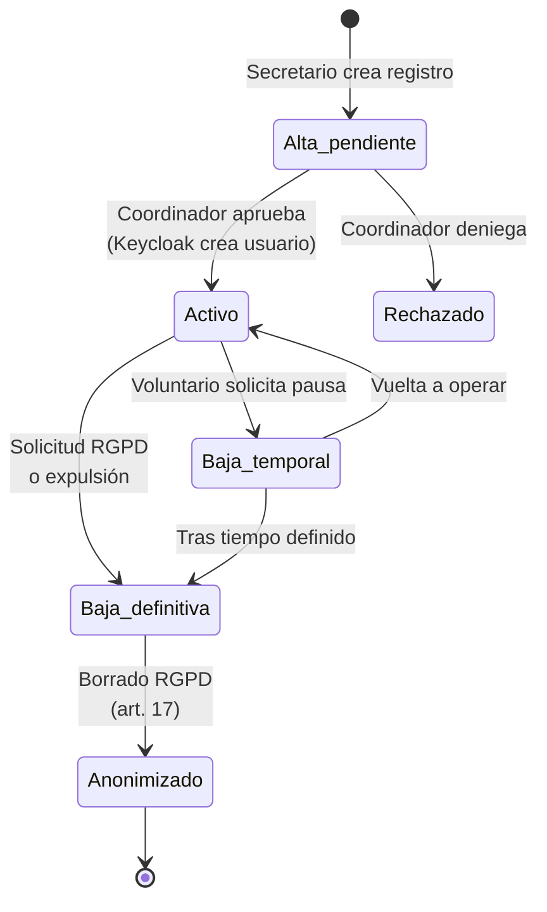
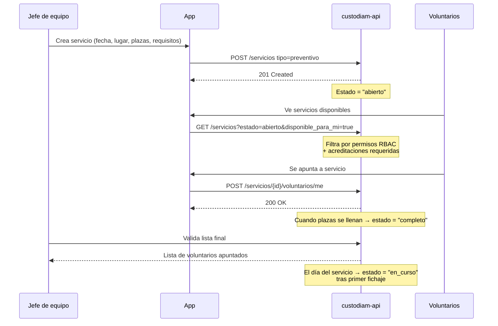
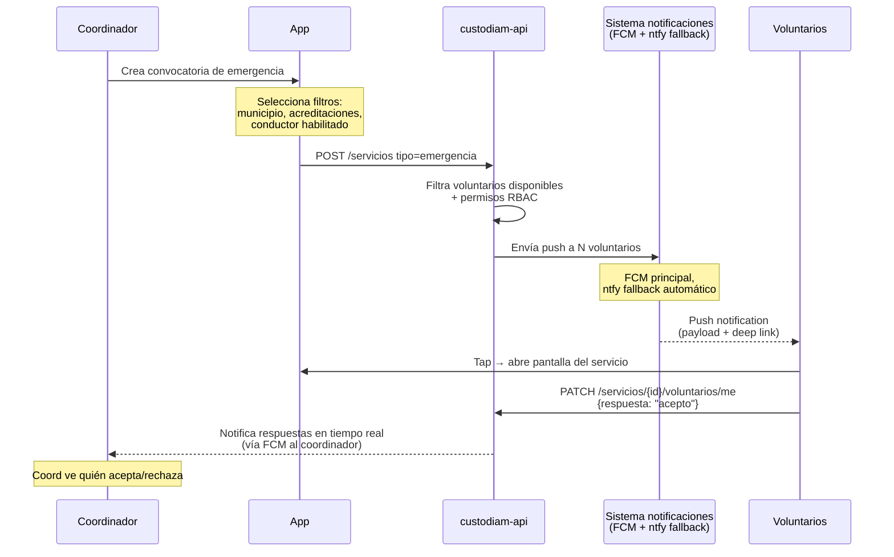
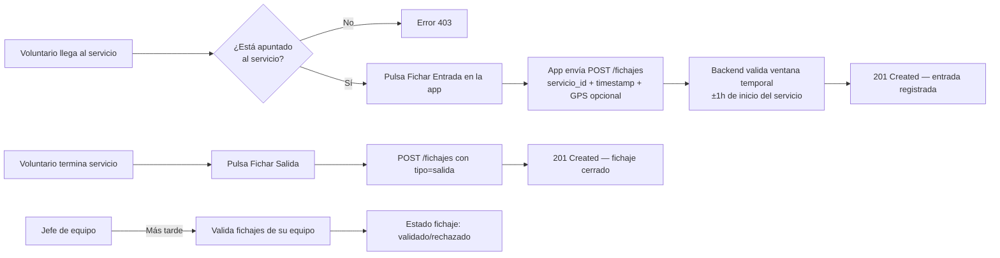

# Flujos de negocio

Esta página recoge los **flujos operativos centrales** de Custodiam tal como los vive el usuario final (coordinador, voluntario, jefe de equipo). Los detalles técnicos viven en otras secciones (arquitectura, ADRs); aquí se prioriza la narrativa del negocio.

## Roles que interactúan

| Rol | Capacidades operativas |
| --- | --- |
| **Voluntario** / **voluntario en prácticas** | Apuntarse a servicios; fichar entrada/salida; ver su perfil. |
| **Jefe de equipo** | Crea servicios preventivos; gestiona equipo asignado a un servicio; valida fichajes de su equipo. |
| **Coordinador** | Convoca emergencias; aprueba altas/bajas; revisa actividad. |
| **Secretario** | Gestiona altas/bajas administrativas; mantiene catálogos. |
| **Tesorero** | Acceso a métricas de actividad para gestión económica. |
| **Admin** | Configuración técnica, backups, exportaciones RGPD. **No tiene capacidades operativas por sí mismo** ([ADR-013](../adrs/adr-013-rbac-lockstep.md)). |

La matriz completa rol → permisos vive en `RBAC_v0.1.0` del repo privado y está espejada en código backend (Python) y cliente (Dart) en lockstep.

## Ciclo del voluntario

**Hitos clave**:

- **Alta_pendiente** crea registro en `voluntarios` con `estado = 'pendiente'` pero **no crea usuario en Keycloak todavía**. La aprobación del coordinador es la que dispara `keycloak_admin.crear_usuario()` y envía email de verificación.
- **Activo → Baja temporal / definitiva** son operaciones **soft delete** (no borran fila). Solo cambian `estado` y registran motivo en `audit_log`.
- **Anonimizado** es operación distinta a `baja_definitiva`: la baja conserva los datos para auditoría histórica; la anonimización los borra/reemplaza por placeholders en cumplimiento del derecho al olvido (RGPD art. 17). Documentada en endpoint `DELETE /voluntarios/{id}/anonimizar` separado del `DELETE` clásico.

## Servicio preventivo

Un **servicio preventivo** es la cobertura programada de un evento (carreras, conciertos, ferias, romerías) donde la agrupación se presenta voluntariamente o por convenio.

**Reglas de negocio**:

- Un voluntario solo puede apuntarse si tiene **todas las acreditaciones requeridas** declaradas en el servicio (ej. carnet B+E + ADR clase II para un servicio que requiere transporte de material).
- El jefe de equipo puede expulsar a un voluntario de un servicio antes de su inicio (con motivo registrado en `audit_log`).
- La asignación voluntario↔servicio es soft: al borrar un servicio, las filas históricas se conservan con `estado = 'cancelado'` para mantener la trazabilidad.

## Emergencia activa

Una **emergencia activa** es la convocatoria inmediata para responder a un evento no programado (incendio, inundación, búsqueda).

**Diferencia clave con preventivo**: el voluntario **no se apunta**, se le **convoca**. El sistema empuja la notificación; el voluntario solo acepta o rechaza.

Más detalle de la lógica de notificaciones y el fallback en [Notificaciones redundantes](notificaciones.md).

## Fichaje

El fichaje registra la **presencia real del voluntario en un servicio** con timestamp y ubicación opcional.

**Reglas operativas**:

- **Ventana temporal**: el fichaje debe ocurrir dentro de ±1 hora del inicio/fin previsto del servicio para considerarse "automático". Fuera de ventana queda en estado `pendiente_validacion` y exige aprobación manual del jefe de equipo.
- **GPS opcional**: el voluntario puede compartir ubicación al fichar (para validación de presencia física), pero no es obligatorio. La aplicación pide permiso explícito y guarda preferencia.
- **Offline-first**: si el voluntario está sin cobertura al fichar (situación habitual en zonas rurales o eventos masivos), el fichaje se persiste en SQLite local del dispositivo y se sincroniza al volver online.

## Inventario (epic E05, pendiente F2)

El módulo de inventario gestiona material y vehículos de la agrupación: alta, asignación a voluntarios o servicios, revisión de mantenimiento, baja por desgaste.

Sigue el mismo patrón de [Modelo de datos](modelo-datos.md) — catálogos `tipos_material` y `tipos_vehiculo` extensibles + tabla de instancias con `JSONB` para campos específicos por tipo (presión de neumáticos, fecha ITV, calibre, color, etc.).

## Referencias

- **[Modelo de datos](modelo-datos.md)** — esquema ER que sostiene estos flujos.
- **[Notificaciones redundantes](notificaciones.md)** — FCM + ntfy.
- **[Audit log](audit-log.md)** — registro cross-module de operaciones críticas.
- **[ADR-013 RBAC lockstep](../adrs/adr-013-rbac-lockstep.md)** — matriz rol → permisos.
- **[Usuarios de prueba](../empezar/usuarios-prueba.md)** — capacidades reales por rol.
