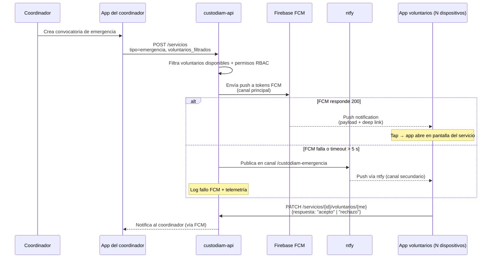

# Notificaciones redundantes

Custodiam usa **dos canales de notificación push** con políticas de redundancia distintas según la criticidad del mensaje. Esta página recoge la visión operativa del sistema.

## Por qué dos canales

Las notificaciones de Custodiam son funcionales (un coordinador convoca a voluntarios a un servicio preventivo o de emergencia) y **una notificación que no llega es un fallo del producto, no de UX**. Un voluntario que no recibe la convocatoria a una emergencia activa porque Firebase Cloud Messaging tuvo un incidente regional no es aceptable. La política de notificaciones del proyecto es **redundancia activa para mensajes críticos**.

A su vez, **Firebase Cloud Messaging (FCM)** sigue siendo el canal nativo de Android y iOS con mejor entrega en background, batería, y soporte de notificaciones ricas (imagen, deep link, acciones). Sustituirlo por completo penaliza al 99 % de los mensajes para protegerse del 1 % de incidentes. Por eso FCM se mantiene como canal principal y se añade **[ntfy](https://ntfy.sh/)** (open-source self-hosted) como respaldo automático cuando FCM falla o devuelve un timeout en mensajes marcados como críticos.

## Topología

```d2
direction: right

app: custodiam-app (móvil) {
  style.fill: "#eef2ff"
  fcm_sdk: firebase_messaging SDK
  ntfy_client: ntfy client\n(HTTP polling)
}

backend: custodiam-api {
  style.fill: "#fefce8"
  servicio: NotificacionesService
  audit: audit_log {
    shape: cylinder
  }
}

external: Servicios externos {
  style.fill: "#fef2f2"
  fcm: Firebase Cloud Messaging\n(Google) {
    shape: cloud
  }
}

self: Self-hosted {
  style.fill: "#f0fdf4"
  ntfy: ntfy\n(contenedor en custodiam-infra) {
    shape: cylinder
  }
}

backend.servicio -> external.fcm: HTTPS
backend.servicio -> self.ntfy: fallback automático {style.stroke-dash: 3}
backend.servicio -> backend.audit

external.fcm -> app.fcm_sdk: push
self.ntfy -> app.ntfy_client: HTTP push
```

## Política de envío por tipo

| Tipo de notificación | Canal primario | Fallback | Reintentos |
| --- | --- | --- | --- |
| **Emergencia activa** (convocatoria) | FCM | ntfy automático si FCM falla o timeout > 5 s | 3 reintentos exponenciales |
| **Convocatoria a servicio preventivo** | FCM | ntfy automático si FCM responde error | 1 reintento |
| **Confirmación / cambio de estado** | FCM | sin fallback | sin reintentos |
| **Informativa (cambio de turno, recordatorio)** | FCM | sin fallback | sin reintentos |

El criterio operativo: **solo las notificaciones donde un fallo de entrega tiene impacto sobre la operación real de la agrupación activan el fallback**. Las notificaciones informativas pueden perderse sin coste; las de emergencia no.

## Flujo de emergencia paso a paso



## Lecciones operativas

- **iOS exige permisos explícitos**. La primera vez que la app se abre, debe solicitarlos. Si el usuario los deniega, no hay notificaciones — la app debe mostrar un aviso reconductivo en el primer flujo afectado (intento de fichar, recepción de servicio).
- **Token FCM rota**. La app re-registra el token en cada arranque y lo sincroniza con el backend. El backend almacena varios tokens por voluntario (uno por dispositivo activo) y borra los que caducan tras 30 días sin uso.
- **ntfy requiere autenticación**. Aunque el servidor es público en el dominio del proyecto, los canales sensibles (emergencia, servicios) están protegidos con tokens emitidos por el backend al hacer login.
- **El backend NO usa el SDK Admin de Firebase para enviar**. Usa la HTTP v1 API directamente con un service account JSON cuyas credenciales viven en `docker/.env.sops` (cifradas con [sops](https://github.com/getsops/sops) + [age](https://github.com/FiloSottile/age)). Esto evita arrastrar el SDK gigante de Google al backend.

## Configuración por entorno

| Entorno | FCM | ntfy |
| --- | --- | --- |
| **dev (Docker Compose)** | Cuenta Firebase del proyecto, app `es.custodiam.dev` | Contenedor local `ntfy` en puerto 8080 |
| **tunnel (Cloudflare)** | Cuenta Firebase del proyecto, app `es.custodiam.dev` | Contenedor ntfy expuesto en `ntfy.custodiam.es` |
| **prod** | Cuenta Firebase del proyecto, app `es.custodiam` | Contenedor ntfy expuesto en `ntfy.custodiam.es` |

Los tres modos están documentados en [ADR-020](../adrs/adr-020-tres-modos-despliegue.md).

## Referencias

- **[Firebase Cloud Messaging](https://firebase.google.com/docs/cloud-messaging)** — documentación oficial.
- **[ntfy](https://ntfy.sh/)** — proyecto open-source.
- **[ntfy GitHub](https://github.com/binwiederhier/ntfy)** — código fuente y self-hosting.
- **[Diagrama del sistema](diagramas.md)** — flujo completo de notificación de emergencia.
