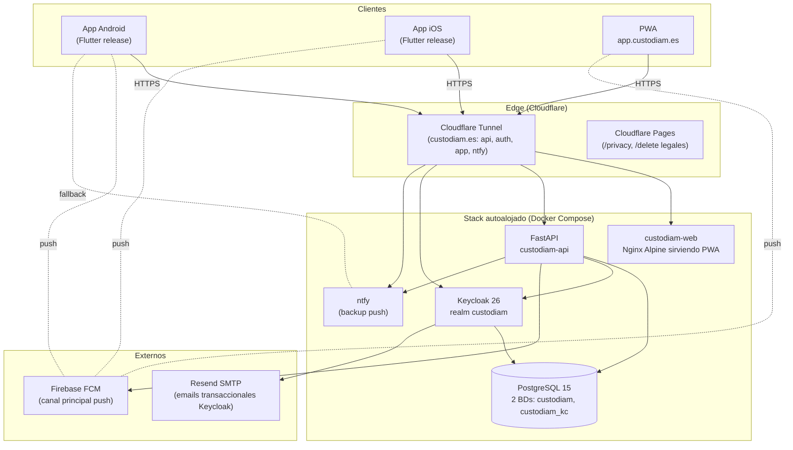

# Stack técnico

Inventario completo de tecnologías del stack de Custodiam por capa, con versiones mínimas y referencias cruzadas a las ADRs que justifican cada elección.

## Frontend (`custodiam-app`)

| Componente | Versión | Decisión |
|---|---|---|
| Flutter SDK | 3.x | Estándar multiplataforma del proyecto |
| Dart | 3.6+ | Sealed classes para `Result<T>` |
| `flutter_riverpod` | ^2.6 | State management — ADR-012 |
| `go_router` | ^17.1 | Navegación con `StatefulShellRoute.indexedStack` |
| `http` | ^1.2 | Cliente HTTP — ADR-004 (no dio) |
| `oauth2` | ^2.0.3 | OAuth2 + PKCE — ADR-010 |
| `flutter_secure_storage` | ^10.0 | Almacenamiento de refresh tokens |
| `firebase_messaging` | ^16.x | Push notifications — ADR-005 |
| `sqflite` (Sprint 9) | ^2.4 | Caché offline-first |

Arquitectura interna **Clean estricta + Feature-first** (ADR-013) con tres capas (`domain` / `data` / `presentation`), Design System propio con prefijo `App*` (ADR-018) y configuración por entorno vía `String.fromEnvironment` (ADR-015).

## Backend (`custodiam-api`)

| Componente | Versión | Decisión |
|---|---|---|
| Python | 3.13 | Gestión vía uv |
| `uv` | 0.9+ | Package manager — ADR-026 |
| `fastapi` | ^0.115 | Web framework |
| `uvicorn[standard]` | ^0.34 | ASGI server |
| `sqlmodel` | ^0.0.22 | ORM unificado — ADR-002 |
| `sqlalchemy` | ^2.0 | Engine subyacente de SQLModel |
| `psycopg[binary]` | ^3.1 | Driver PostgreSQL — ADR-008 |
| `alembic` | ^1.14 | Migraciones de schema |
| `PyJWT[crypto]` | ^2.11 | Validación local de JWT — ADR-010 |
| `pydantic` | ^2.10 | Validación de schemas |
| `pydantic-settings` | ^2.7 | Configuración desde `.env` |
| `httpx` | ^0.28 | Cliente HTTP (llamadas a Keycloak Admin API) |
| `ruff` | ^0.8 | Linter + formatter |
| `pytest` | ^8.3 | Tests |

Estructura `app/{core,models,schemas,routers,services}`. Sesión SQLModel inyectada vía `Depends(get_session)`. RBAC con `Permission` enum + `require_permission` factory (definido en `RBAC_v0.1.0`).

## Infraestructura (`custodiam-infra`)

| Componente | Versión | Decisión |
|---|---|---|
| Docker Compose | 2.x | Orquestador local — ADR-007 |
| PostgreSQL | 15-alpine | BD relacional |
| Keycloak | 26+ | IdP OIDC — ADR-010 |
| ntfy | latest | Notificaciones backup — ADR-005 |
| n8n | latest | Automatización (post-MVP, profile `full`) |
| Cloudflare Tunnel | latest | Exposición HTTPS sin abrir puertos — ADR-022 |
| Mock OIDC server | 2.1.10 | Tests del cliente OIDC en `custodiam-app` (profile `test`) |
| sops + age | latest | Gestión de secretos cifrados — ADR-019 |
| `just` | 1.40+ | Command runner (interfaz preferida) |

Tres modos de despliegue (dev / tunnel / prod) mutuamente excluyentes con guard de cross-mode (ADR-020). Imágenes publicadas en GHCR (`ghcr.io/custodiam/custodiam-api`, `ghcr.io/custodiam/custodiam-app`).

## Documentación pública (`custodiam-book`)

| Componente | Versión | Decisión |
|---|---|---|
| Material for MkDocs | ^9.5 | Theme + engine — ADR-027 |
| `mkdocs-mermaid2-plugin` | ^1.2 | Renderizado nativo Mermaid |
| `mike` | ^2.1 | Versionado de docs (instalado, no activado en F1) |
| `pymdown-extensions` | ^10.13 | Admonitions, tabs, code blocks |
| Python + uv | 3.13 + 0.9+ | Mismo stack que `custodiam-api` |

Hosted en **GitHub Pages directo** (vendor-lock-free) con dominio propio `docs.custodiam.es` vía CNAME en Cloudflare DNS modo `DNS only`. Workflow CI con `astral-sh/setup-uv@v3` + `mkdocs build` + `peaceiris/actions-gh-pages@v4`.

## Diagrama del stack (alto nivel)

Diagrama detallado por flujo (autenticación OAuth, propagación de eventos, etc.) en **[Diagramas del sistema](diagramas.md)**.

## Referencias

- **[Empezar](../empezar/index.md)** — cómo levantar el stack completo.
- **[ADRs](../adrs/index.md)** — registro de decisiones técnicas con justificación.
